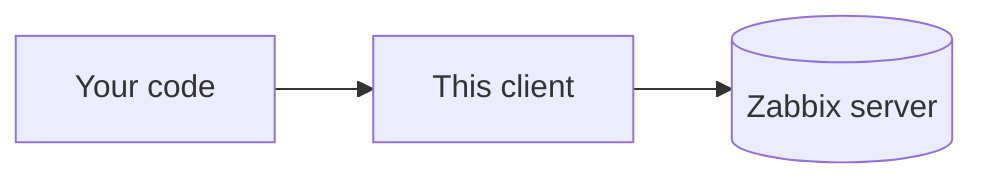

# Architecture

The client is layered. A call enters through `ZabbixApi`, is validated locally, then descends through the JSON-RPC and HTTP layers to the server.

## Sub-systems

- [Entry point and dispatch](architecture/entry-point.md) — how `ZabbixApi` and its API groups turn a call into a validated request, and how the one-time `apiinfo.version` probe rides along.
- [Request validation](architecture/validation.md) — how params are checked against the bundled schema before anything is sent.
- [Transport](architecture/transport.md) — how `JsonRpcClient` and `HttpClient` carry requests to the server and order the responses.

## Related

- [Schemas and validation](schemas-and-validation.md) — what the schemas cover and how a method maps to its file.
- [JSON-RPC client](json-rpc.md) — using the low-level client directly.
- [Batching](batching.md) — the how-to for queuing several calls.
