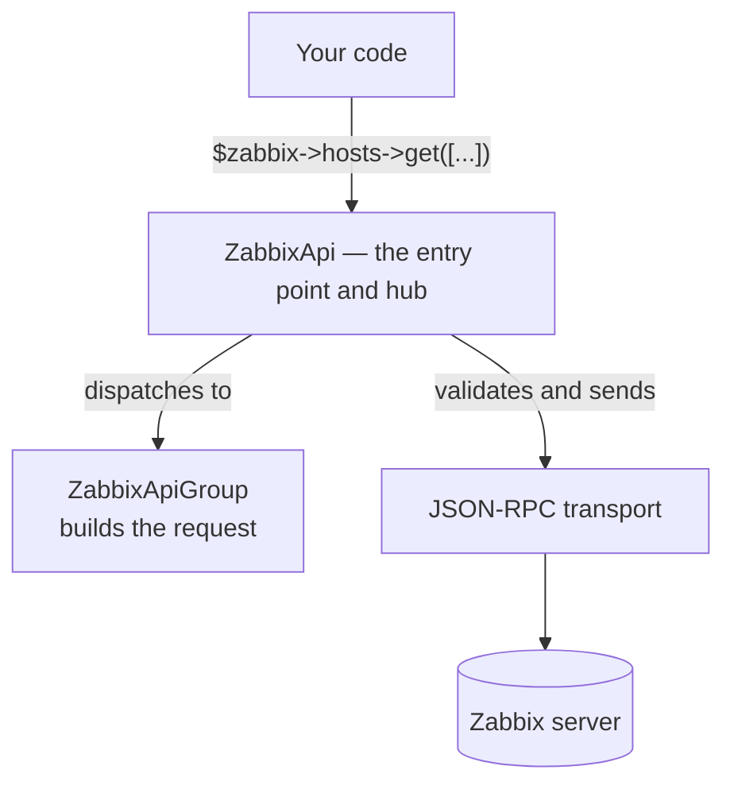
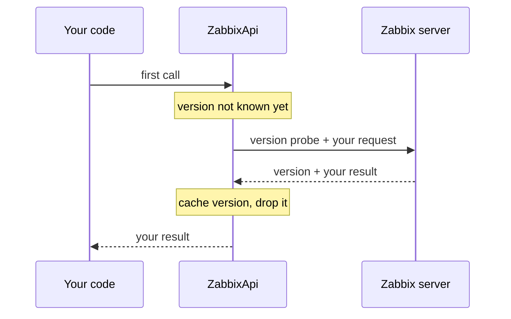

# Entry point and dispatch

`ZabbixApi` is the canonical entry point for application code. Its API-area properties — `$hosts`, `$hostGroups`, `$items`, and the rest — are `ZabbixApiGroup` dispatchers bound to the same `ZabbixApi` instance at construction; they are not separate doors. `ZabbixApi` dispatches your call to the matching group, which builds the request object; `ZabbixApi` then validates and sends it. Every group call converges on that one execution hub.

The hub validates each request, sends one with `JsonRpcClient::call()` or several with `JsonRpcClient::batch()`, and maps each response to a result — raising `ZabbixApiException` on a server error. Whether you pass a single `Request` to `request()` or accumulate several with `batch()`, the path is the same.

## The version probe rides along

`ZabbixApi` resolves the Zabbix version once, through `apiinfo.version`. Rather than spend a separate round trip, the hub prepends that probe to the first request it sends, then drops the extra result before returning yours.

Every later call skips the probe and sends on its own.

## See also

- [Request validation](validation.md) — the check the hub runs before sending
- [Transport](transport.md) — how the hub's requests reach the server
- [Batching](../batching.md) — the how-to for queuing several calls
