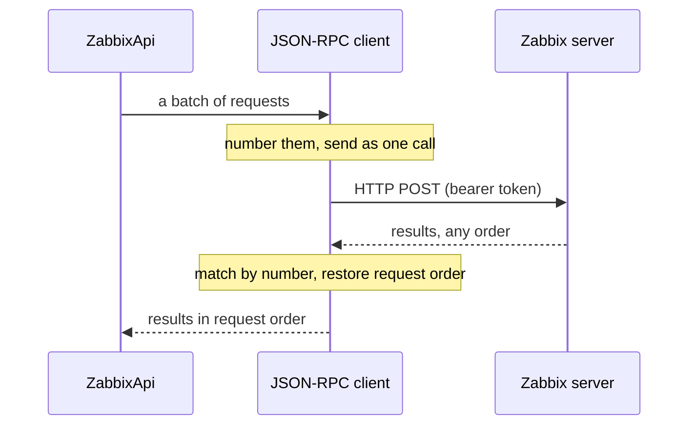

# Transport

Below validation, two clients carry the request to Zabbix. `JsonRpcClient` owns the JSON-RPC 2.0 protocol; `HttpClient` owns the HTTP and JSON boundary. `Options` configures both from your constructor options.

`JsonRpcClient` turns each `Request` into a `{jsonrpc, method, id, params}` envelope, sends one or a batch through the transport, and normalizes every decoded reply into a `JsonRpcResponse`. JSON-RPC 2.0 lets a server answer a batch in any order, so the client matches responses to requests by id and returns them in request order. Protocol errors stay inside `JsonRpcResponse` as data; `ZabbixApi` turns them into a `ZabbixApiException`.

`HttpClient` accepts a JSON-ready payload, POSTs it through the configured Guzzle client, and decodes the response body once. It expects its Guzzle client to arrive fully configured — endpoint, bearer header, timeouts, and TLS all come from `Options`.

## See also

- [JSON-RPC client](../json-rpc.md) — using `JsonRpcClient` directly
- [Configuration](../configuration.md) — the options that configure the transport
- [Entry point and dispatch](entry-point.md) — how a request reaches this layer
