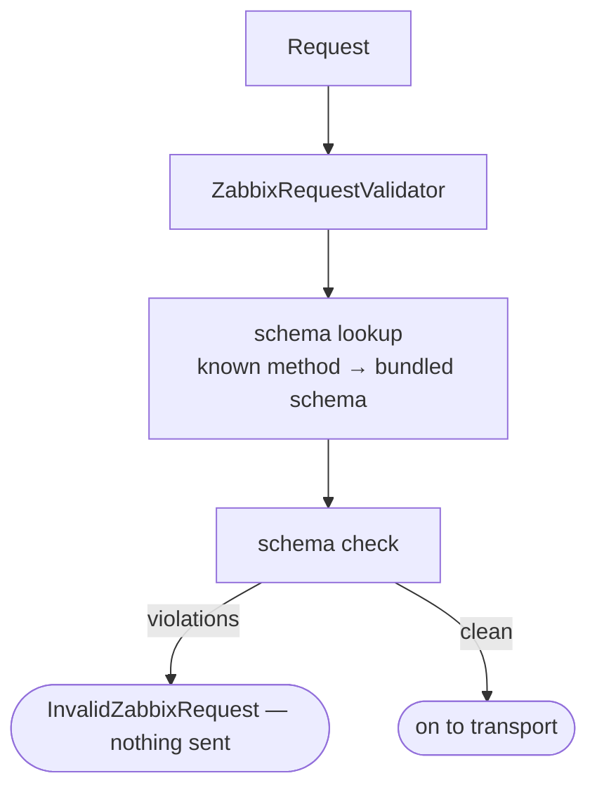

# Request validation

Before any request leaves the client, `ZabbixApi` runs it through `ZabbixRequestValidator`. The validator resolves the request's schema and checks its params; a mismatch throws `InvalidZabbixRequest` and nothing is sent.

`ZabbixRequestValidator::createDefault()` wires the default provider and validator behind the `SchemaProvider` and `SchemaValidator` interfaces, so either side can be substituted in tests.

- `JSONSchemaProvider` resolves the method through `Registry` — an unregistered method throws `UnknownZabbixMethod` — then loads the bundled schema file into a `JSONSchema`.
- `JSONSchemaValidator` checks the params against that schema with `justinrainbow/json-schema` and returns a list of violations, which the validator turns into `InvalidZabbixRequest`.

## See also

- [Schemas and validation](../schemas-and-validation.md) — what the schemas cover and how a method maps to its file
- [Error handling](../error-handling.md) — catching `InvalidZabbixRequest`
- [Entry point and dispatch](entry-point.md) — where validation sits in the call path
